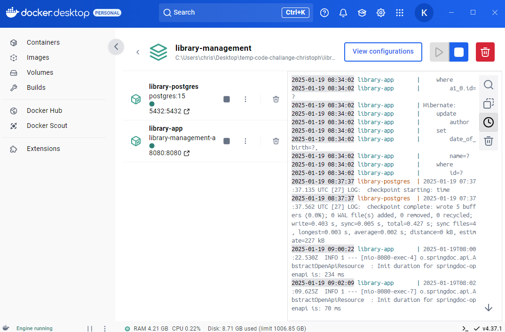
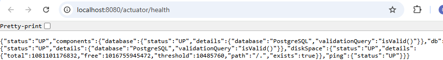
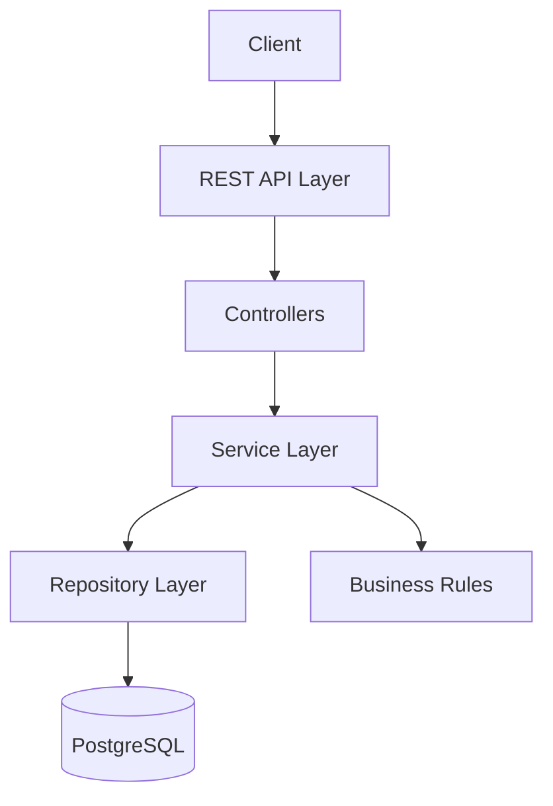
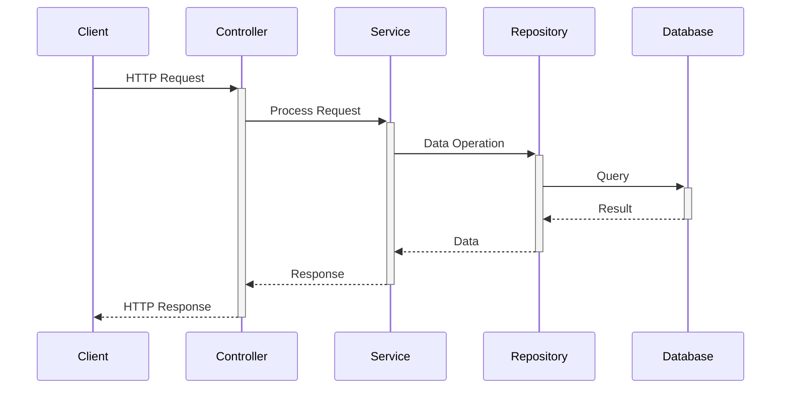
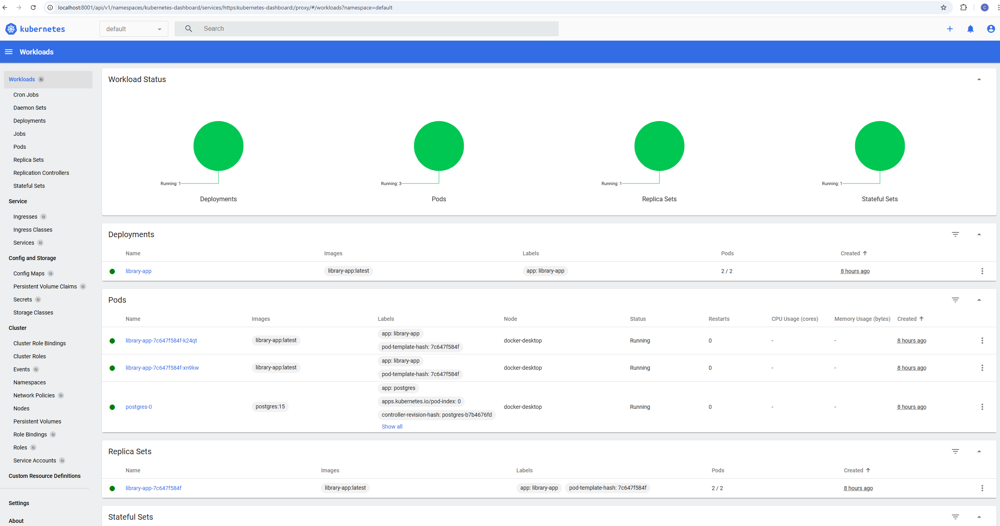
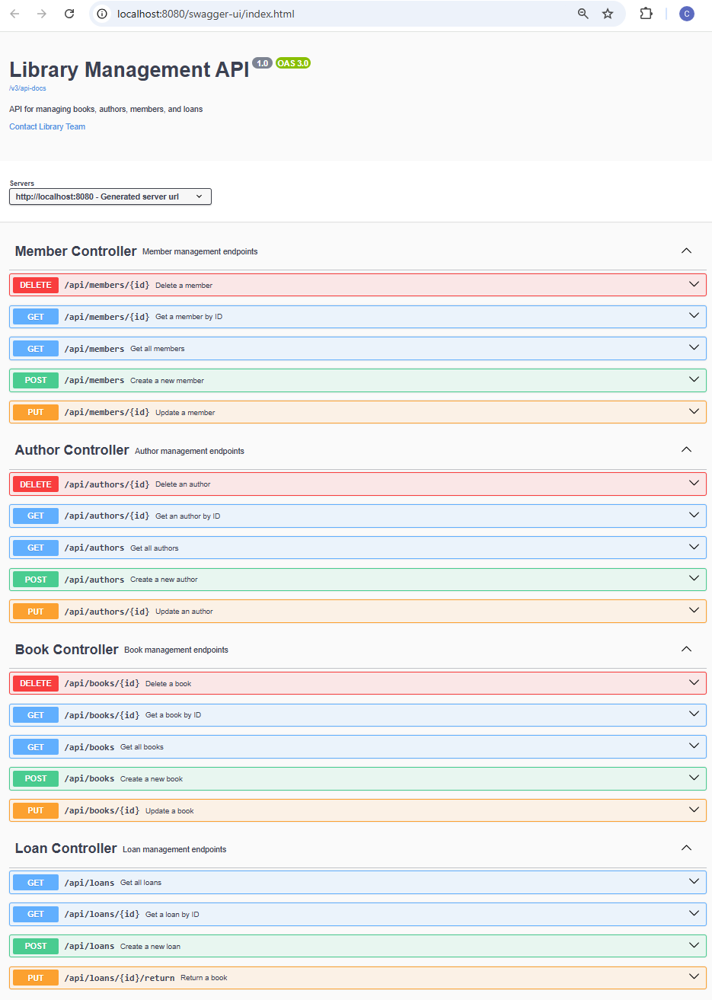

# Library Management System

## Table of Contents

- [Overview](#overview)
- [Project Structure](#project-structure)
- [Quick Start](#quick-start)
- [Architecture](#architecture)
- [Core Components](#core-components)
- [Deployment](#deployment)
- [API Design](#api-design)
- [Development Guide](#development-guide)
- [Operational Considerations](#operational-considerations)
- [Testing Guide](#testing-guide)
- [Security Considerations](#security-considerations)
- [Conclusion](#conclusion)

---

## Overview

A Java-based library management system implementing book lending operations using Spring Boot, PostgreSQL, and Docker.

### Key Features

- **Book Management**: Tracks individual books with unique copy constraints
- **Author Management**: Maintains author information with book relationships
- **Member Management**: Handles member registration with unique identification
- **Loan Processing**: Enforces lending rules and tracks book circulation

### Technical Foundation

- **Framework**: Spring Boot 3.2.1 chosen for its enterprise capabilities and robust ecosystem
- **Language**: Java 17 selected for LTS support and modern features
- **Database**: PostgreSQL 15 implements reliable data persistence
- **Build System**: Gradle provides dependency management and build automation
- **Containerization**: Docker enables consistent deployment across environments

---

## Version Information

- Version: 1.0.0
- Last Updated: 2024-01-19
- Status: Production Ready

---

## Project Structure

```plaintext
library-management/
├── .gradle/ - Gradle cache and build metadata
├── .idea - IntelliJ IDEA configuration files
├── build - Compiled output and build artifacts
│   ├── classes/ - Compiled Java classes
│   ├── generated/ - Generated source files
│   ├── reports/ - Test and analysis reports
│   ├── resources/ - Processed resources
│   └── test-results/ - Test execution results
├── gradle/  - Gradle wrapper files
│   └── wrapper/- Gradle wrapper configuration
├── images/  - Documentation screenshots
├── kubernetes/ - Kubernetes deployment files
└── src/ - Source code root
    ├── main/  - Application source code
    │   ├── java/com/library/ - Java package structure
    │   │   ├── config/ - Application configuration classes
    │   │   ├── controller - REST API endpoints
    │   │   ├── domain/ - Entity definitions
    │   │   ├── dto/ - Data transfer objects
    │   │   ├── exception/ - Error handling classes
    │   │   ├── repository - Data access interfaces
    │   │   └── service/ - Business logic implementation
    │   └── resources/ - Application resources
    │       ├── db/migration/ - Flyway database migrations
    │       ├── static/ - Static resources
    │       └── templates/ - Template files
    └── test/ - Test source code
        ├── java/com/library/ - Test package structure
        │   ├── integration/ - Integration tests
        │   ├── repository - Repository layer tests
        │   └── service/ - Service layer tests
        └── resources/ - Test resources

Additional files:
├── .env - Environment variables
├── build.gradle  - Gradle build configuration
├── Dockerfile - Application container definition
└── docker-compose.yml  - Container orchestration config
```

---

## Quick Start

### Prerequisites

- Docker Desktop (latest version)
  - Windows: Enable WSL 2 and Kubernetes
  - Minimum 8GB RAM allocated
  - Virtualization enabled in BIOS
- Java Development Kit (JDK) 17
  - OpenJDK or Eclipse Temurin recommended
  - JAVA_HOME environment variable set
- IDE (Optional for development)
  - IntelliJ IDEA Ultimate recommended
  - With Docker and Spring Boot plugins

### System Requirements

- Operating System
  - Windows 10/11 Pro or Enterprise
  - WSL 2 enabled
- Hardware
  - Minimum 16GB RAM recommended
  - 4 CPU cores recommended
  - 10GB free disk space

### Step-by-Step Setup

**Clone Repository**

```powershell
git clone https://github.com/CH6832/library-management.git
cd library-management
```

**Configure Environment**

```powershell
Copy-Item .env.example .env
```

**Start Application**

```powershell
# Build and start all container
docker-compose up --build
# Verify that containers are running
docker ps
```



**Verify Installation**

- Database: PostgreSQL running on port 5432
- Application: Spring Boot running on port 8080
- Swagger UI: http://localhost:8080/
- Health Check: http://localhost:8080/actuator/health



---

## Architecture

### System Architecture Overview

#### Layered Architecture

Our application follows a classical layered architecture for clear separation of concerns:



1. **Presentation Layer (Controllers)**
   - Handles HTTP requests/responses
   - Manages API documentation
   - Implements input validation
   - Routes to appropriate services

2. **Business Layer (Services)**
   - Implements core business logic
   - Enforces business rules
   - Manages transactions
   - Coordinates between layers

3. **Data Access Layer (Repositories)**
   - Handles database operations
   - Manages entity relationships
   - Implements data queries
   - Ensures data persistence

4. **Domain Layer (Entities)**
   - Defines core business objects
   - Implements validation rules
   - Represents data structure
   - Maintains entity relationships

#### Component Interactions



```plaintext
Client Request → Controller → Service → Repository → Database
Response ← Controller ← Service ← Repository ← Database
```

#### Package Structure

```plaintext
com.library/
├── controller/    # REST endpoints
├── service/       # Business logic
├── repository/    # Data access
├── domain/        # Entities
├── dto/           # Data transfer
└── exception/     # Error handling
```

#### Key Design Decisions

1. **Database Design**
   - PostgreSQL for ACID compliance
   - Flyway for migrations
   - Optimized indexes
   - Referential integrity

2. **API Design**
   - RESTful principles
   - Resource-based URLs
   - Stateless operations
   - Clear error responses

3. **Business Rules Implementation**
   - Service layer validation
   - Database constraints
   - Domain model rules
   - Transaction management

4. **Security Considerations**
   - Input validation
   - Error handling
   - Data sanitization
   - Constraint checking

#### Technology Stack Rationale

1. **Spring Boot**
   - Enterprise-grade framework
   - Robust ecosystem
   - Production-ready features
   - Extensive documentation

2. **PostgreSQL**
   - ACID compliance
   - Robust performance
   - Rich feature set
   - Strong community support

3. **Docker & Kubernetes**
   - Container orchestration
   - Scalability
   - Environment consistency
   - Easy deployment

### Data Architecture

#### Database Design

##### Schema Organization

**Structure**:
- Normalized tables for efficient data storage
- Foreign key relationships for data integrity
- Indexes for query optimization

**Why This Approach**:
- Minimizes data redundancy
- Ensures referential integrity
- Optimizes query performance

##### Data Integrity

**Implementation**:
- Unique constraints for member data
- Foreign key relationships for entity associations
- Check constraints for business rules

**Why These Constraints**:
- Prevents duplicate entries
- Maintains data consistency
- Enforces business rules at database level

---

## Core Components

### Entity Management

#### Book Entity

**What**: Represents individual books in the library system
**Key Attributes**:
- Title and genre for categorization
- Price for inventory valuation
- Single author relationship
- Unique copy constraint

**Why This Design**:
- Enforces single-copy inventory management
- Maintains clear author attribution
- Enables efficient searching and categorization

#### Author Entity

**What**: Manages author information and book relationships
**Key Attributes**:
- Name and biographical data
- Birth date tracking
- Book collection relationship

**Why This Design**:
- Supports multiple books per author
- Maintains biographical integrity
- Enables author-based queries

#### Member Entity

**What**: Handles library member information
**Key Attributes**:
- Unique username and email
- Contact information
- Loan history tracking

**Why This Design**:
- Ensures unique member identification
- Maintains communication channels
- Tracks lending activity

#### Loan Entity

**What**: Manages book lending operations
**Key Attributes**:
- Member and book relationships
- Date tracking (lend/return)
- Status management

**Why This Design**:
- Enforces lending limits
- Tracks book circulation
- Maintains lending history

---

## Deployment

### Kubernetes

```powershell
# Apply Kubernetes configurations
kubectl apply -f kubernetes/
# Verify deployment
kubectl get pods
kubectl get services
kubectl get deployments
```

```powershell
PS C:\Users\chris\Desktop\temp-code-challange-christoph\library-management> kubectl get pods
NAME                           READY   STATUS    RESTARTS   AGE
library-app-7c647f584f-k24qt   1/1     Running   0          8h
library-app-7c647f584f-xn9kw   1/1     Running   0          8h
postgres-0                     1/1     Running   0          8h
PS C:\Users\chris\Desktop\temp-code-challange-christoph\library-management> kubectl get services
NAME                  TYPE           CLUSTER-IP     EXTERNAL-IP   PORT(S)        AGE
kubernetes            ClusterIP      10.96.0.1      <none>        443/TCP        8h
library-app-service   LoadBalancer   10.106.47.56   localhost     80:30380/TCP   8h
postgres-service      ClusterIP      None           <none>        5432/TCP       8h
PS C:\Users\chris\Desktop\temp-code-challange-christoph\library-management> kubectl get deployments
NAME          READY   UP-TO-DATE   AVAILABLE   AGE
library-app   2/2     2            2           8h
PS C:\Users\chris\Desktop\temp-code-challange-christoph\library-management>
```



### Scaling and Maintenance

```powershell
# Scale deployment
kubectl scale deployment library-app --replicas=3
# Monitor scaling
kubectl get pods -w
```

### Kubernetes Resource Verification

1. **Pod Status**
   - Check readiness
   - Verify health probes
   - Monitor logs

2. **Service Status**
   - Verify endpoints
   - Check port mappings
   - Confirm load balancing

3. **Deployment Status**
   - Check rollout status
   - Verify replicas
   - Monitor resource usage

### Verification Steps

1. **Check Application Status**
   - Green health indicators in Docker Desktop
   - No error messages in logs
   - Database migrations completed

2. **Access API Documentation**
   - Open Swagger UI in browser
   - All endpoints visible
   - Try example API calls



### Common Issues and Solutions

1. **Port Conflicts**
   - Error: Port 8080/5432 already in use
   - Solution: Stop conflicting services or change ports in docker-compose.yml

2. **Database Connection**
   - Error: Cannot connect to PostgreSQL
   - Solution: Check container logs, verify environment variables

3. **Memory Issues**
   - Error: Container exits unexpectedly
   - Solution: Increase Docker Desktop resource limits

---

## API Design

### RESTful Endpoints

#### Resource Organization

**Structure**:
- /api/books - Book management
- /api/authors - Author operations
- /api/members - Member handling
- /api/loans - Loan processing

**Why This Structure**:
- Follows REST best practices
- Provides intuitive resource access
- Enables clear API navigation

#### Documentation

**Implementation**:
- OpenAPI/Swagger integration
- Interactive API testing
- Comprehensive endpoint documentation

**Why This Approach**:
- Facilitates API understanding
- Enables interactive testing
- Maintains up-to-date documentation

---

## Development Guide

### Local Setup

#### Prerequisites

**Requirements**:
- Docker Desktop
- Java 17 JDK
- IDE (preferably IntelliJ IDEA)
- Git for version control

**Why These Tools**:
- Ensures consistent development
- Provides necessary development capabilities
- Maintains code quality

#### Build Process

**Steps**:
1. Environment configuration
2. Database initialization
3. Application compilation
4. Container deployment

**Why This Process**:
- Ensures reproducible builds
- Maintains development consistency
- Simplifies onboarding

---

## Operational Considerations

### Monitoring and Maintenance

#### Health Checks

**Implementation**:
- Application health endpoints
- Database connection monitoring
- Resource utilization tracking

**Why This Monitoring**:
- Ensures system availability
- Enables proactive maintenance
- Identifies potential issues

#### Error Handling

**Strategy**:
- Comprehensive exception handling
- Meaningful error messages
- Appropriate HTTP status codes

**Why This Approach**:
- Improves debugging
- Enhances user experience
- Facilitates troubleshooting

---

## Business Rules Implementation

### Lending Rules

#### Book Circulation

**Rules**:
- Maximum 5 active loans per member
- Single copy per book
- Date-based tracking

**Why These Rules**:
- Ensures fair resource distribution
- Maintains inventory control
- Enables efficient tracking

#### Member Management

**Rules**:
- Unique username/email
- Required contact information
- Active loan tracking

**Why These Rules**:
- Prevents duplicate accounts
- Ensures communication capability
- Maintains lending control

---

## Testing Guide

### CRUD Operations Testing (Windows)

All commands use PowerShell for Windows environments.

1. **Author Operations**
```powershell
# Create Author (POST)
Invoke-RestMethod -Method Post -Uri "http://localhost:8080/api/authors" -ContentType "application/json" -Body '{
    "name": "John Doe",
    "dateOfBirth": "1990-01-01"
}'

# Get Author (GET)
Invoke-RestMethod -Method Get -Uri "http://localhost:8080/api/authors/1"

# Update Author (PUT)
Invoke-RestMethod -Method Put -Uri "http://localhost:8080/api/authors/1" -ContentType "application/json" -Body '{
    "name": "John Smith",
    "dateOfBirth": "1990-01-01"
}'

# Delete Author (DELETE)
Invoke-RestMethod -Method Delete -Uri "http://localhost:8080/api/authors/1"
```

2. **Book Operations**
```powershell
# Create Book (POST)
Invoke-RestMethod -Method Post -Uri "http://localhost:8080/api/books" -ContentType "application/json" -Body '{
    "title": "Sample Book",
    "genre": "Fiction",
    "price": 29.99,
    "authorId": 1
}'

# Get Book (GET)
Invoke-RestMethod -Method Get -Uri "http://localhost:8080/api/books/1"

# Update Book (PUT)
Invoke-RestMethod -Method Put -Uri "http://localhost:8080/api/books/1" -ContentType "application/json" -Body '{
    "title": "Updated Book",
    "genre": "Non-Fiction",
    "price": 39.99,
    "authorId": 1
}'

# Delete Book (DELETE)
Invoke-RestMethod -Method Delete -Uri "http://localhost:8080/api/books/1"
```

3. **Member Operations**
```powershell
# Create Member (POST)
Invoke-RestMethod -Method Post -Uri "http://localhost:8080/api/members" -ContentType "application/json" -Body '{
    "username": "johndoe",
    "email": "john@example.com",
    "address": "123 Main St",
    "phoneNumber": "1234567890"
}'

# Get Member (GET)
Invoke-RestMethod -Method Get -Uri "http://localhost:8080/api/members/1"

# Update Member (PUT)
Invoke-RestMethod -Method Put -Uri "http://localhost:8080/api/members/1" -ContentType "application/json" -Body '{
    "username": "johndoe",
    "email": "john.updated@example.com",
    "address": "456 Oak St",
    "phoneNumber": "0987654321"
}'

# Delete Member (DELETE)
Invoke-RestMethod -Method Delete -Uri "http://localhost:8080/api/members/1"
```

4. **Loan Operations**
```powershell
# Create Loan (POST)
Invoke-RestMethod -Method Post -Uri "http://localhost:8080/api/loans" -ContentType "application/json" -Body '{
    "memberId": 1,
    "bookId": 1,
    "lendDate": "2024-01-19"
}'

# Get Loan (GET)
Invoke-RestMethod -Method Get -Uri "http://localhost:8080/api/loans/1"

# Return Book (PUT)
Invoke-RestMethod -Method Put -Uri "http://localhost:8080/api/loans/1/return" -ContentType "application/json"

# Get All Loans (GET)
Invoke-RestMethod -Method Get -Uri "http://localhost:8080/api/loans"
```

Testing Sequence:
1. Create an author first
2. Then create a book (needs author_id)
3. Create a member
4. Create a loan (needs both member_id and book_id)
5. Test other operations

---

## Security Considerations

### Data Protection

#### Input Validation

**Implementation**:
- Request validation
- Data sanitization
- Constraint checking

**Why This Security**:
- Prevents invalid data
- Protects system integrity
- Ensures data quality

---

## Conclusion

### System Benefits

- Robust library management
- Efficient resource tracking
- Scalable architecture
- Maintainable codebase

### Future Considerations

- Authentication implementation
- Advanced search capabilities
- Reporting functionality
- Performance optimization
